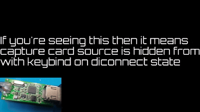
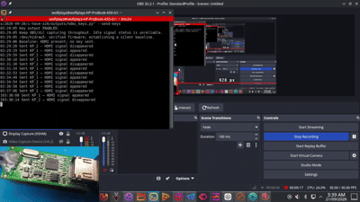
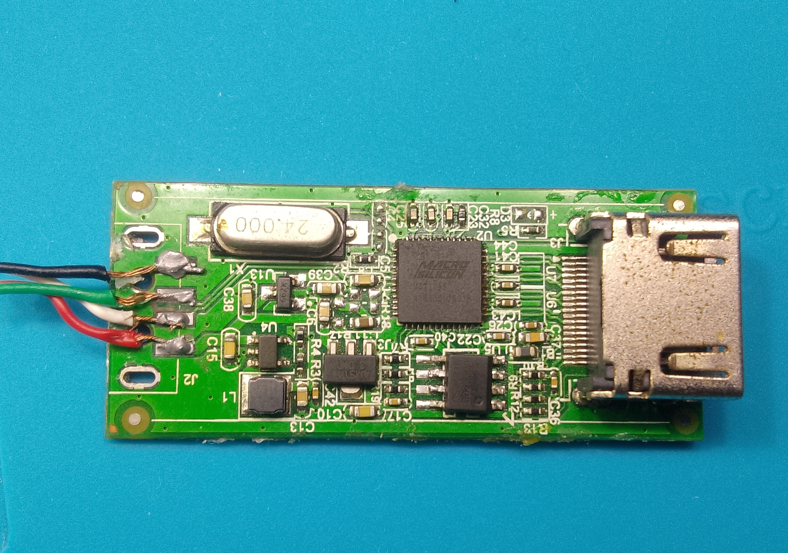
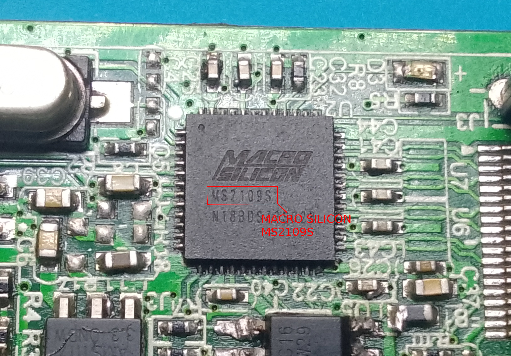
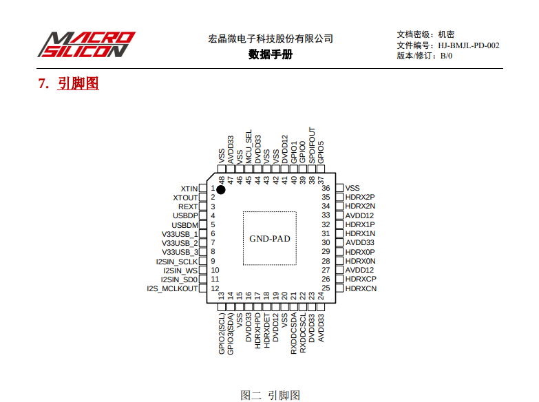
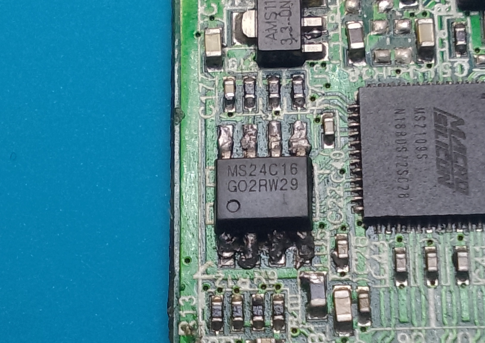
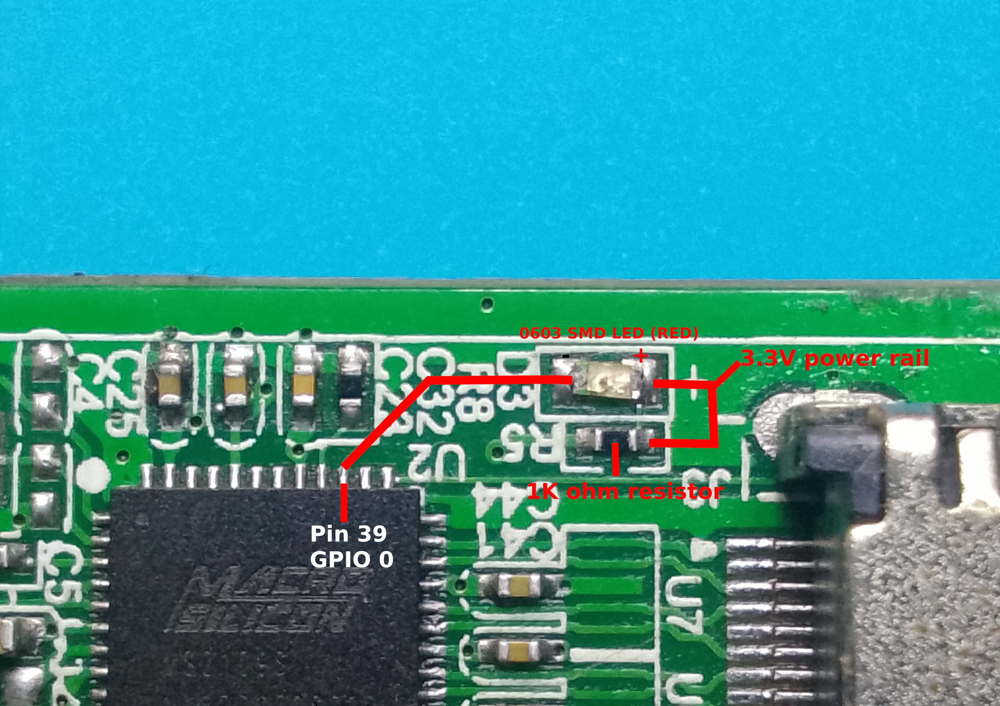
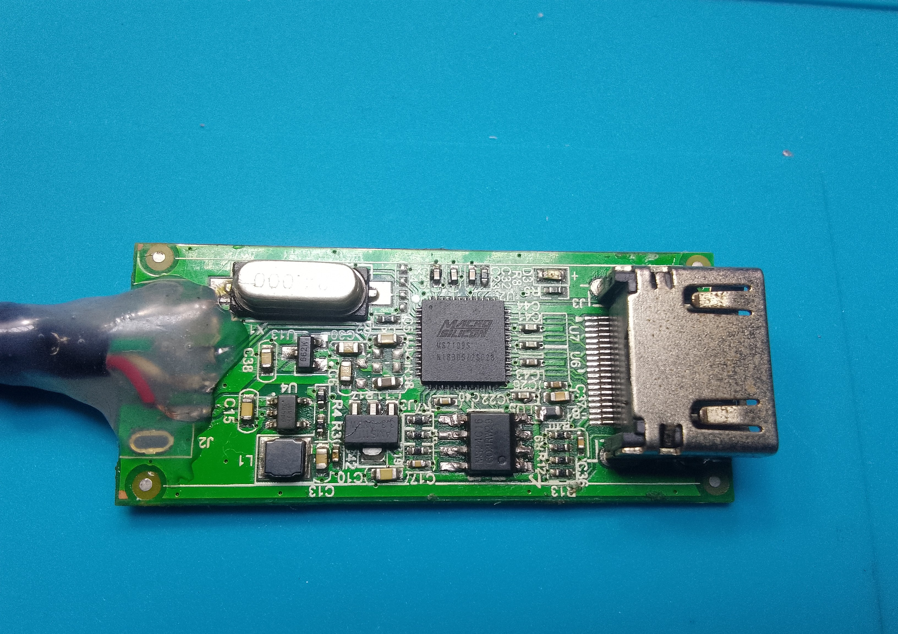

# MS2109 D7 HDMI Signal LED

**A hardware modification and host-side tooling package for a MacroSilicon MS2109-based USB HDMI capture card.**

Documented 2026-09-21 for the specific USB 2.0 HDMI capture board tested by **proot**.

This project adds a visible LED indication of incoming HDMI video to a cheap capture card that previously offered none, and pairs it with a Linux X11 watcher that can drive application shortcuts when the signal appears or disappears.

---

## 1. Overview

Cheap USB HDMI capture cards based on the MacroSilicon MS2109 family often provide no reliable visual feedback that a video signal is present. In the original use case an NVR’s output selection could introduce capture lag, and the stock board gave no useful indication of whether video was arriving.

This project:

- Installs an LED on the board’s existing D3 footprint.
- Patches the external EEPROM so the LED blinks while the tested signal flag reports video.
- Supplies a small Linux watcher that reads the same status over HID and can emit synthetic numpad key events (KP_1 / KP_2) for use as application hotkeys.

**Tested configuration**

| Component              | Detail                                      |
|------------------------|---------------------------------------------|
| Capture processor      | MacroSilicon MS2109 family, **D7 revision** |
| HID chip-ID read       | `0xF800` → `0xD7`                           |
| USB identity           | `345f:2109`                                 |
| Programmed device      | External MS24C16 I²C EEPROM (16 Kbit / 2048 bytes) |
| Programmer             | CH341A (`1a86:5512`), EPP/MEM/I²C mode      |
| Working image          | `ms2109_d7_led_v1.bin` (2048 bytes)         |
| Firmware marker        | `D7LED01`                                   |
| LED connection         | D3 footprint, active-low GPIO0 (chip pin 39)|
| Host environment       | Linux X11 desktop                           |

**Important limitation**  
Keep capture active in OBS, VLC or an equivalent application. When capture is idle the card can report a stale status and the LED may blink even with no HDMI cable attached. This project does not remove that firmware behaviour.

Shell examples in this document assume you are working from the root of the repository unless a different working directory is shown. Replace `/home/proot` in the programmer examples with your own home directory.

---

## 2. Demonstrations

### 2.1 Capture-card test



The animation shows the capture test with the modified board visible in the inset. It is a demonstration only; it is not a calibrated measurement of blink rate, frame rate or latency.

### 2.2 OBS source test



The host-side watcher sends synthetic numpad events. OBS itself was not modified; bind the keys to the desired actions inside your application.

---

## 3. Board and Wiring Gallery

All media embedded below comes from this repository’s `images/` folder. Photographs and recordings document the particular board used for development. Visually similar products can contain a different PCB revision.

### 3.1 Product reference


The product-reference screenshot helps identify the general enclosure style. Marketing claims on the packaging are not specifications verified by this project.

### 3.2 Opened PCB



The processor, external EEPROM, HDMI connector and USB pad. Replaced it's original USB connector and attempted to mod the capture card before but failed before this project is made.

### 3.3 Processor marking



Package marking is MS2109S. The D7 revision identification comes from the live HID chip-ID read, not from the package name alone.

### 3.4 Pinout reference



The pinout image is a tracing aid. It is not an original diagram authored by this project. Confirm package orientation and continuity before relying on any numbered pin.

### 3.5 External EEPROM



This is the storage chip programmed with the CH341A. The capture processor’s internal mask ROM is never rewritten.

### 3.6 LED connection detail



The annotation identifies the D3 area, GPIO0 / pin 39 and the supply path. Confirm the approximately 980 Ω series resistance and polarity on your own board; do not assume every clone uses the same layout.

### 3.7 Assembled modification



This is the hardware used for the reported LED and keybind tests.

---

## 4. Authorship and Scope

The custom D7 LED patch, image builder, diagnostic scripts, keybind watcher were produced by OpenAI’s ChatGPT/Codex assistant and this document were revised ny xAI's Grok for proot. They were developed on top of the independent upstream research and tools credited in Section 12.

proot supplied the board, original image, photographs, continuity and voltage measurements, and live diagnostic results; performed the soldering and CH341A flashing; and confirmed that the LED and numpad keybindings worked. The assistant did not physically program or test the board.

This is a board-tested custom patch, **not** official MacroSilicon firmware and **not** a claim of authorship over upstream research, code or mask ROM. Upstream licenses and attribution remain applicable. This repository packages the working D7 build and host tools. Renaming the binary does not change its contents or flash checksum.

---

## 5. Hardware Summary

| Item                     | This project                                      |
|--------------------------|---------------------------------------------------|
| Capture processor        | MacroSilicon MS2109 family, D7 revision           |
| HID chip-ID              | `0xF800` returns `0xD7`                           |
| USB identity             | `345f:2109`                                       |
| Programmed device        | External MS24C16 I²C EEPROM (16 Kbit / 2048 bytes)|
| Programmer               | CH341A (`1a86:5512`)                              |
| Working image            | `ms2109_d7_led_v1.bin` (2048 bytes)               |
| Firmware marker          | `D7LED01`                                         |
| LED connection           | D3, active-low GPIO0 (reported as chip pin 39)    |

The CH341A writes the EEPROM only. At startup the processor’s mask ROM loads the EEPROM patch into RAM and calls its enabled hooks. The firmware architecture and HID interface are described in the upstream projects listed in Section 12; the D7-specific layout was cross-checked against the NKTKLN reference ROM.

---

## 6. Repository Contents

```text
ms2109_d7_led_v1.bin      Ready-to-flash, verified 2048-byte image
firmware.asm              D7 hook code and embedded display descriptor
build_image.py            EEPROM image / checksum builder
check_led_status.py       Read-only device diagnostics
hdmi_keys.py              Debounced HDMI-to-numpad watcher for X11
70-ms2109-hid.rules       udev rule for local desktop user HID access
test_hdmi_keys.py         Hardware-free watcher unit tests
images/                   Board photos, pinout and two demonstration GIFs
SHA256SUMS                Published firmware checksum
```

The published binary contains the working LED patch and display configuration. Its shorter filename is an organisational change only; it is not a different firmware build. Original backups, failed prototype images, compiled scratch files and third-party ROM dumps are deliberately excluded.

Earlier A7-format LED images from development were **not** the successful D7 build and are not included. Those images could be read back from the EEPROM, but the intended code never appeared at the expected runtime addresses. D7 identification and the reference ROM led to the replacement D7-compatible patch. An EEPROM write verification alone does not prove that the processor loaded the patch.

**Working image SHA-256**

```text
3101e40ffa25133b350a7a6d94248b513af5c3fd01f2d07f7752a455f6b121fd
```

---

## 7. How the LED Works

### 7.1 Physical connection

The board’s D3 positive pad was traced through an approximately 980 Ω resistor to its supply; the other pad was traced to GPIO0. The user installed the LED. An earlier suspected DVDD12 connection was a measurement error and must not be used as wiring guidance. Retain the verified series resistor and check the actual traces on any different board.

GPIO0 is controlled through `P2.0`. Clearing `P3.0` enables its output on this D7 implementation. The LED is active-low: a low GPIO level sinks current and turns the LED on; a high level turns it off.

Background research on GPIO handling came from BertoldVdb/ms-tools; D7 behaviour was verified against the reference ROM and observations on this board.

### 7.2 Firmware behaviour

The patch adds a private 8-bit timer phase at RAM address `0xCC03`. The timer hook:

1. Preserves the original D7 timer body’s three 16-bit counter increments and the `0xF005` acknowledgement.
2. Increments the private phase counter.
3. Does **not** insert a delay loop or reconfigure the timer.

The normal hook reads the top bit of the phase and reapplies the LED output after ROM activity.

The observed signal flag is **IRAM byte `0x20`, bit 4** (mask `0x10`):

- Bit clear → signal present → phase values 0–127 request LED on, 128–255 request LED off.
- Bit set   → signal absent  → LED forced off.

This mapping is supported by live connected/disconnected measurements taken while capture was active. It is not a guarantee for every MS2109 revision.

Host diagnostic samples advanced by roughly 50 counts per half-second, suggesting approximately 100 timer ticks per second, 1.28 s per half-cycle and 2.56 s per complete blink. These figures are estimates derived from host sampling, not a calibrated frequency specification.

### 7.3 States exposed to the host

| Condition (capture active) | Observed `flags20` | `flags20 & 0x10` | Interpretation     | LED request              | Watcher event after stable change |
|----------------------------|--------------------|------------------|--------------------|--------------------------|-----------------------------------|
| HDMI video present         | `0x84`             | `0x00`           | Signal present     | Alternates with phase    | `KP_1` (numpad 1)                 |
| HDMI video absent          | `0x94`             | `0x10`           | Signal absent      | Off                      | `KP_2` (numpad 2)                 |
| USB / HID unavailable      | (no valid reading) | Unknown          | Unknown            | Host cannot determine    | None; watcher pauses              |
| First stable reading       | Either             | Either           | Baseline           | Firmware controls LED    | None                              |

Only bit 4 is interpreted. Do not require the entire byte to equal `0x84` or `0x94`. The LED itself never generates keyboard events; the Python watcher reads the flag over HID and separately asks the desktop to generate keys. The diagnostic column `requested_LED` is calculated from flag and phase; it is not an electrical read-back of the LED pin.

**Known limitation**  
With OBS/VLC closed (or otherwise not capturing) the flag may be stale or misleading. The user observed blinking with no HDMI attached while capture was idle. Keep capture active for reliable use of the tested flag. The timing record at `0xC71A` also retained its previous mode after HDMI loss, so it is not used as proof of current signal presence. This system detects the reported video-signal state; it does not detect whether a physical cable is plugged in or whether the picture is black.

### 7.4 Patch layout and identification

| Location                  | Value / purpose                                      |
|---------------------------|------------------------------------------------------|
| EEPROM bytes 0–1          | `5A A5` – D7 image magic                             |
| EEPROM bytes 2–3          | `02 00` – 512-byte payload                           |
| EEPROM bytes 4–5          | `09 10` – hook enable and EDID feature gate          |
| EEPROM payload offset     | `0x30` (loaded at `0xCC00`)                          |
| `0xCC00`                  | `02 CC 80` – jump to normal hook                     |
| `0xCC03`                  | Mutable phase counter                                |
| `0xCC04`                  | ASCII marker `D7LED01`                               |
| `0xCC30`                  | `02 CC 40` – jump to timer hook                      |
| `0xCD00`                  | 256-byte EDID                                        |
| Runtime header `0xCBD0`   | Starts `5A A5 02 00 09 10`                           |

D7 event 8 supplies the EDID through the ROM routine at `0x73F7`. The image uses the reference header configuration bytes `18 09 06 11` at offsets 12–15 because the board’s original factory D7 header was unavailable. No complete donor executable payload was imported. The patch reproduces the original ROM timer-body behaviour and depends on specific ROM addresses. Do not assume these addresses apply to A7 or other chip revisions.

---

## 8. Resolution Behaviour

The custom EDID advertises 1280×720 @ 60 Hz as the preferred video mode. This is intended to encourage sources such as the NVR to select 720p rather than a higher-resolution mode. The patch also sets the UVC default frame index 6 in the relevant MJPEG/YUYV descriptors. These are separate input-advertisement and host-default changes; they do not force every source or application to comply.

In the capture application select MJPEG, 1280×720, 60 fps when available. The EEPROM does **not** guarantee 60 unique captured frames per second, eliminate latency, or convert a slower source into true 60 fps. Reconnect or restart any source that has cached the previous EDID.

---

## 9. Building the Image

With SDCC’s assembler, linker and binary conversion tools installed:

```bash
mkdir -p build
cp firmware.asm build_image.py build/
cd build
sdas8051 -lo firmware.rel firmware.asm
sdld -nui -b HOME=0xCC00 -i firmware.ihx firmware.rel
sdobjcopy -I ihex -O binary firmware.ihx firmware.bin
python3 build_image.py
cmp ms2109_d7_led_v1.bin ../ms2109_d7_led_v1.bin
cd ..
```

The builder:

- Writes a 2048-byte image.
- Places the 512-byte payload after the 48-byte header.
- Appends the header/payload additive checksums.
- Verifies both EDID block checksums.

The recorded build was additionally checked with an opcode interpreter across all 256 timer phases, both signal states, event routing, register preservation and GPIO bit isolation. Runtime loading and actual blinking were later confirmed on the physical board. The reference ROM and research workspace used during development are not redistributed. The included Python test suite covers the host watcher only.

---

## 10. Flashing with the CH341A (Linux)

The tool used was [command-tab/ch341eeprom](https://github.com/command-tab/ch341eeprom) (local path example: `/home/proot/Documents/ch341-tools/ch341eeprom`). It uses libusb; the appearance of `1a86:5512` in `lsusb` is the relevant detection, not a serial-port device.

Soldered connections were used because the clip proved unreliable. Disconnect the capture card’s USB and HDMI before programming, and disconnect the programmer and its wiring before normal USB operation. Verify programmer voltage, ground and the EEPROM’s SDA/SCL/VCC connections yourself; this document does not infer safe electrical levels from the adapter’s appearance. The CH341A must use its 24-series I²C connections, not an assumed SPI layout.

### 10.1 Preserve matching backups

```bash
cd /home/proot/Documents/ch341-tools/ch341eeprom
sudo ./ch341eeprom -s 24c16 -c 0 -r before-change-1.bin
sudo ./ch341eeprom -s 24c16 -c 0 -r before-change-2.bin
cmp before-change-1.bin before-change-2.bin
wc -c before-change-1.bin
```

Use `-c 0` **after** `-s 24c16`. Earlier reads without the corrected selection returned the wrong header despite matching each other. Matching reads establish repeatability; they do not by themselves prove correct addressing. Inspect the header and keep a known-good backup under a new filename.

### 10.2 Write and verify

```bash
fw="/absolute/path/to/ms2109-d7-hdmi-led/ms2109_d7_led_v1.bin"
wc -c "$fw"
sha256sum "$fw"
sudo ./ch341eeprom -s 24c16 -c 0 -w "$fw"
sudo ./ch341eeprom -s 24c16 -c 0 -r d7-led-readback.bin
cmp "$fw" d7-led-readback.bin && echo "VERIFIED"
xxd -l 16 d7-led-readback.bin
```

Expected first 16 bytes:

```text
5a a5 02 00 09 10 ff ff ff ff ff ff 18 09 06 11
```

No separate erase step was used. A “Wrote 2048 bytes” message alone is insufficient. In this project an initial comparison failed at byte 1; after the connections were resoldered the read-back matched and printed `VERIFIED`. Treat a failed comparison as a failed flash.

### 10.3 Post-flash check

After disconnecting the programmer, power the card normally via USB and run:

```bash
sudo python3 check_led_status.py --d7-led
```

Expected output includes: `PASS: D7 LED code and hooks loaded.`

Then keep capture active and test HDMI loss/return. To recover, use the same write/read/compare procedure with a preserved known-good backup, followed by a power cycle. A backup taken after flashing contains the current D7 patch, not the original factory image.

---

## 11. HID Status and Keybind Watcher

The vendor HID command `0xB5` reads a memory address. This card exposes IRAM `0x20` through that interface. The Linux helper sends a read request with HID SET_FEATURE, reads the reply with GET_FEATURE, and checks the echoed command/address. A SET_FEATURE read request is **not** a firmware or register write. See the protocol description in amnemonic/MacroSilicon and the Linux hidraw API documentation.

Core interpretation used by the tools:

```python
flags20 = read_byte(fd, 0x20)
signal_present = not bool(flags20 & 0x10)
# GPIO LED request inside the firmware:
led_on = signal_present and read_byte(fd, 0xCC03) < 128
```

`hdmi_keys.py` is the full runnable example. It:

- Identifies the card and verifies the `D7LED01` marker.
- Polls every 0.2 s.
- Requires one second of stable state before acting.
- Emits a single numpad key per transition.
- Establishes a silent baseline on startup and on USB reconnection.
- Pauses detection on read failures rather than sending a false HDMI-disconnect key.
- Prevents duplicate watcher instances.
- Defaults to logging only.

Key-output portion (simplified):

```python
import subprocess

def emit_hdmi_key(signal_present):
    key = "KP_1" if signal_present else "KP_2"
    subprocess.run(
        ["xdotool", "key", "--clearmodifiers", "--delay", "300", key],
        check=True, timeout=5,
    )
# Call only after a debounced transition, never on every poll or on the initial reading.
```

The key press was lengthened during troubleshooting of missed events. F13/F14 were tried first but did not register in the user’s OBS hotkey fields even after lengthening; switching to numpad 1/2 worked. The exact cause of the F13/F14 failure was not established.

### 11.1 Setup

```bash
sudo apt install xdotool
sudo install -m 644 70-ms2109-hid.rules /etc/udev/rules.d/70-ms2109-hid.rules
sudo udevadm control --reload-rules
```

Reconnect the card’s USB after installing the udev rule. Keep `hdmi_keys.py` and `check_led_status.py` together. Start OBS/VLC capture, turn Num Lock on, and run the watcher as the desktop user **without** sudo:

```bash
# Log only (safe first run)
python3 hdmi_keys.py

# Generate keys
python3 hdmi_keys.py --send-keys
```

To bind a key without changing HDMI state, run one of the following and click the desired OBS hotkey field within five seconds:

```bash
python3 hdmi_keys.py --test-key KP_1
python3 hdmi_keys.py --test-key KP_2
```

Run the two tests separately so there is time to select the correct field. Each test sends a real key. Release modifiers before binding. Stop the watcher with Ctrl+C before stopping capture. These are the numeric-keypad keys, not the number row; pressing the physical keypad keys will also activate the bound actions.

System-wide injection does not broadcast ordinary typing to every application. Normal events reach the focused window; background actions depend on the target application’s global-hotkey handling.

### 11.2 Wayland note

The LED firmware and USB HID status reading are independent of X11/Wayland. The **current keyboard-output backend is X11-only**; the script explicitly rejects key-output mode when `XDG_SESSION_TYPE=wayland`. Log-only mode does not require X11.

xdotool’s XTEST approach is not a general solution for native Wayland applications. A possible future replacement is a virtual keyboard via Linux **uinput** (`/dev/uinput`), which would require appropriate device permissions and compositor acceptance. Application/global-shortcut behaviour would still need testing. No Wayland backend or virtual-keyboard implementation is included in this repository. The supplied udev rule enables HID access only; it does not grant access to `/dev/uinput`. No autostart service is installed.

---

## 12. Quick Validation and Troubleshooting

1. Run `sha256sum -c SHA256SUMS` from the repository root before flashing.
2. Verify the EEPROM write with a fresh read-back; a successful write message is not sufficient.
3. Disconnect the programmer, boot over USB and run the D7 diagnostic. Confirm chip ID, header, hook jumps and the `D7LED01` marker before interpreting signal readings.
4. Start capture, leave USB connected and disconnect HDMI. The absent bit should become 1 and the LED request should be off.
5. Reconnect an active HDMI source. The absent bit should become 0 and the phase should progress while the LED blinks.
6. Try the watcher in log-only mode before enabling actual keys. A steady state must not repeatedly emit events.

| Symptom                                      | Check / action                                                                 |
|----------------------------------------------|--------------------------------------------------------------------------------|
| Programmer not found                         | Look for USB ID `1a86:5512`. This mode does not need a serial tty.             |
| Two backup reads match but header looks wrong| Confirm `-s 24c16 -c 0`, EEPROM type and wiring. Repeatability ≠ correct address. |
| EEPROM comparison differs                    | Recheck solder joints; do not treat the image as verified.                     |
| D7 marker or hook check fails                | Confirm exact image, successful read-back and a full power cycle.              |
| LED blinks without HDMI while capture closed | Known idle-status limitation; start capture before interpreting.               |
| HID permission denied                        | Install the udev rule, reconnect USB, run watcher as desktop user.             |
| Watcher prints “Would send”                  | Dry-run mode. Use `--send-keys` to enable key output.                          |
| No event at startup                          | Intentional silent baseline; cause a real HDMI transition after baseline settles. |
| USB removal causes no numpad 2               | Intentional: losing the card is an unknown state, not confirmed HDMI loss.     |
| Application misses a key                     | Test with `--test-key KP_1`; enable Num Lock; verify X11 session.              |
| Wayland key output rejected                  | Current backend is X11-only (see Section 11.2).                                |

Run the included host tests without hardware or injected key events:

```bash
python3 -m unittest test_hdmi_keys -v
```

The tests cover initial-state suppression, connection/disconnection mapping, noise rejection, reconnect baseline behaviour and firmware validation. Passing the unit tests is not a substitute for testing the actual board and target desktop application.

---

## 13. Media and Attribution

The repository includes only the nine supplied files in `images/`: seven still images and two GIFs, each embedded above. Photographs, annotations and recordings were supplied by proot. The product screenshot and MacroSilicon-branded pinout contain third-party material; supplying or hosting them does not transfer ownership or establish a new licence. No external image URLs or invented media are used.

---

## 14. Repositories and Acknowledgements

| Repository                                      | Role                                                                 |
|-------------------------------------------------|----------------------------------------------------------------------|
| [NKTKLN/ms2109-d7-1024x600](https://github.com/NKTKLN/ms2109-d7-1024x600) | D7 ROM, reverse-engineering notes and tools; D7 header/hooks/EDID reference. Local reference commit `3e671e282850a581b3f8dd822b3545e55ef51ba5`. Its 1024×600 firmware is **not** the image flashed here. |
| [amnemonic/MacroSilicon](https://github.com/amnemonic/MacroSilicon) | MS2109 memory map and vendor HID read protocol (command/address echo format). |
| [BertoldVdb/ms-tools](https://github.com/BertoldVdb/ms-tools) | MacroSilicon GPIO/firmware research, especially GPIO data and direction handling. Also a dependency credited by the D7 reference project. The final physical flash used CH341A, not an assumed `msctl` operation. |
| [kraln/macrosilicon_firmware](https://github.com/kraln/macrosilicon_firmware) | Origin confirmed from the user’s local original-firmware checkout; earlier firmware, boot and patch-architecture investigation. The first A7-based LED attempt was superseded by the successful D7 patch. |
| [command-tab/ch341eeprom](https://github.com/command-tab/ch341eeprom) | Actual Linux CH341A / 24C16 flashing tool. Local commit `7cffbef7552d93162bd90cae836a45e94acb93fb`. README credits original author asbokid and modifications by command-tab. |
| [jordansissel/xdotool](https://github.com/jordansissel/xdotool) | X11 synthetic key events in the host watcher; key timing and Wayland limitations. |

**Build tooling**  
[SDCC](https://sdcc.sourceforge.net/)

**Programmer-tool ancestry**  
[asbokid’s ch341eepromtool](https://sourceforge.net/projects/ch341eepromtool/)

Linux API references are linked in the relevant sections above. Hardware observations and the successful numpad/LED results come from proot’s tests, not from claims made by the upstream projects.
